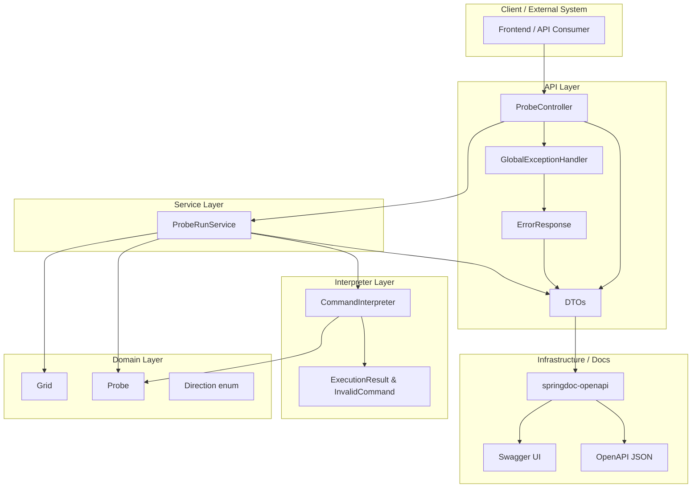
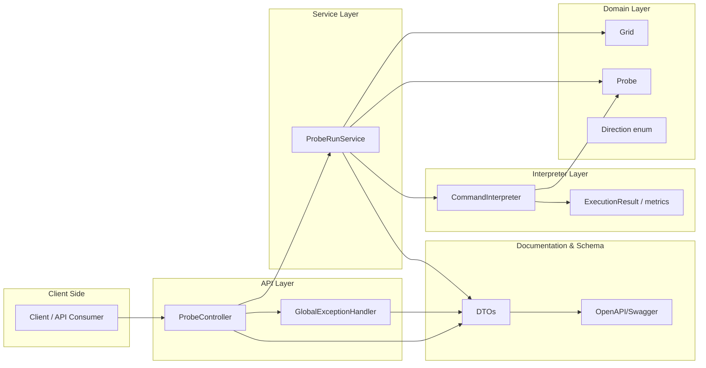
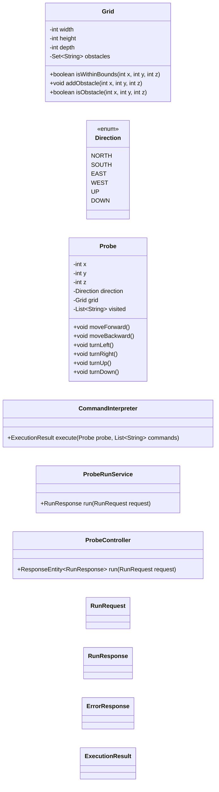
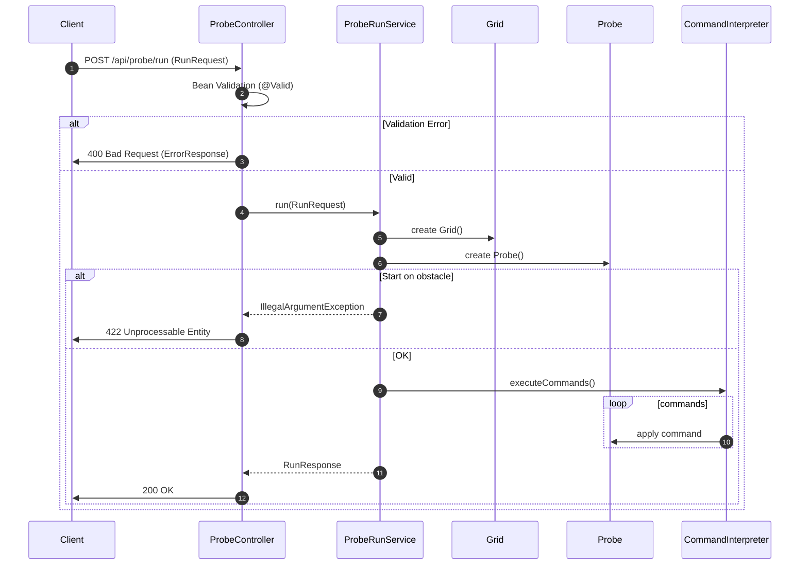
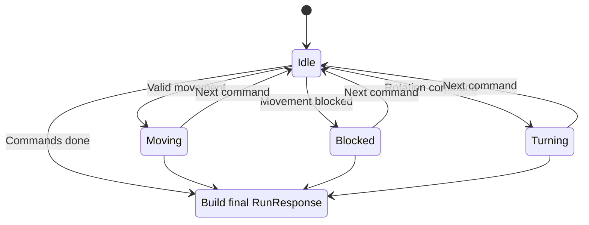
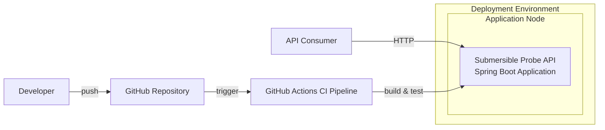

# Architecture & TDD Summary

This document provides a full architectural overview, TDD evolution, and system diagrams for the Submersible Probe Navigation API.

## 1. Architecture Overview

(Existing content retained — extended details added in sections below.)

## 2. High-Level System Architecture Diagram

---

## 3. Component Breakdown

These are the major functional units of the application.

### **API Layer**

* Handles HTTP requests and responses.
* Performs validation using `@Valid`.
* Exposes `/api/probe/run` endpoint.
* Uses `GlobalExceptionHandler` for consistent error formatting.

### **Service Layer**

* Orchestrates full probe execution.
* Creates Grid, Probe, and delegates execution.
* Builds final RunResponse.

### **Domain Layer**

* Contains pure business logic.
* Framework-free.
* Includes Grid, Probe, Direction.

### **Interpreter Layer**

* Parses commands.
* Executes movements.
* Tracks metrics: invalid commands, blocked commands, executed commands.

### **Error & Documentation Layer**

* `ErrorResponse` model for consistent errors.
* OpenAPI/SpringDoc integration.

---

## 4. Component Diagram

---

## 5. Domain Model

The domain layer contains all core business logic and is fully independent of Spring.

### **Grid**

* Defines 3D boundaries.
* Stores obstacles.
* Validates movement.

### **Probe**

* Holds current position and direction.
* Executes movements and turns.
* Tracks visited coordinates.

### **Direction Enum**

* NORTH, SOUTH, EAST, WEST, UP, DOWN.
* Provides rotation rules.

### **Business Rules**

* Cannot leave grid.
* Cannot enter obstacle.
* Every movement attempt is recorded.
* Every valid position is added to visited list.

---

## 6. Class Diagram

---

## 7. Request Processing Flow

The `/api/probe/run` operation follows these steps:

1. **Client sends request** with grid/start/direction/commands.
2. **Controller validates** input using Bean Validation.

    * If invalid → 400 Bad Request.
3. **ProbeRunService orchestrates** domain objects.
4. **Domain construction**:

    * Build Grid.
    * Add obstacles.
    * Instantiate Probe.
5. **Start position validation**.

    * If obstacle at start → 422.
6. **CommandInterpreter processes commands**.
7. **Metrics collected** (blocked, invalid, executed).
8. **RunResponse constructed**.
9. **Controller returns 200 OK**.

---

## 8. Sequence Diagram

---

## 9. Probe State Behaviour

The probe cycles through states depending on command type.

### **States**

* **Idle**: Before command execution.
* **Moving**: Position updated successfully.
* **Turning**: Direction updated.
* **Blocked**: Movement prevented.
* **Completed**: All commands processed.

### **Key Rules**

* Movement → Moving → Idle.
* Rotation → Turning → Idle.
* Blocked movement → Blocked → Idle.
* End of commands → Completed.

---

## 10. State Machine Diagram

---

## 11. Deployment Architecture

The system is fully stateless and easy to deploy.

### **Components**

* **Developer Machine** → pushes code.
* **GitHub Repo** → holds source.
* **CI Pipeline** → runs Maven build & tests.
* **Runtime Environment** → executes Spring Boot JAR.
* **Clients** → interact with API via HTTP & Swagger UI.

### **Topology Summary**

* Client → API → Service → Domain → Interpreter → Domain → API → Client
* No database, no external systems.
* Stateless → horizontally scalable.

---

## 12. Deployment Diagram

---

## 13. Test-Driven Development (TDD)

This project follows strict **Red → Green → Refactor** methodology.

### **Approach**

* Every feature began with a failing test.
* Minimal code added to make the test pass.
* Refactoring applied once all tests were green.
* Domain layer built entirely through TDD.
* API controller tests written after service layer stabilized.

### **TDD Benefits in This Project**

* Predictable, well-tested behaviour.
* High confidence in edge-case handling.
* Clean, modular domain architecture.

---

## 14. TDD Commit Summary

A full chronological commit-by-commit TDD evolution is documented in **GIT_HISTORY.md**.

It includes:

* Domain bootstrapping
* Grid boundary tests
* Movement logic TDD cycles
* Obstacle logic TDD cycles
* Interpreter-driven TDD loops
* API validation tests
* Swagger documentation commits
* Refactoring + cleanups

---

## 15. Documentation Enhancements

The project includes:

* **Complete Swagger/OpenAPI coverage** for all endpoints
* **Schema annotations** for all DTOs
* **Error model documentation** for validation & domain errors
* **README examples & usage instructions**
* **Architecture & TDD Summary** (this file)

These ensure excellent developer experience.

---

## 16. CI/CD

A GitHub Actions workflow runs:

* JDK 21
* `mvn verify`
* Compile, test, validate documentation

This enforces consistent code quality for every push and PR.

---

## 17. Result

This project demonstrates:

* Clean architecture
* Fully tested domain logic
* Strong TDD discipline
* High-quality documentation
* Robust API modelling
* Production-ready error strategy
* Clear extensibility for future features

It is suitable for demonstrating deep understanding of:

* Java
* Spring Boot
* TDD
* Clean code principles
* System architecture

---

# **End of Document**\nSpring Boot Application]
